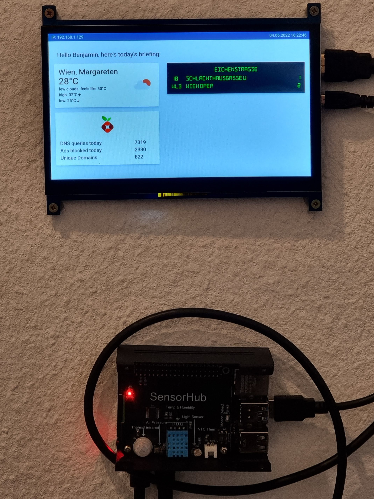

# Raspberry Pi dashboard



## Requirements
 - Raspberry Pi or similar board
 - Screen (1024x600)
 - Internet connection
 - Open Weather API key

## Recommended
 - EP-0106 Sensor Hub Development board

## Setup server

If you have an EP-0106 Sensor Hub board attached make sure to enable I2C in the raspi-config
interface options before proceeding.

Make sure you have git, nodejs and systemd installed before starting the setup process.  

Download and execute the setup script. This will create a new user, clone the project,
build the server and install a systemd startup task to launch the server on boot.

```bash
wget https://raw.githubusercontent.com/RaederDev/iot-display/main/bin/setup.sh && chmod +x setup.sh
sudo ./setup.sh
```

After setup was completed you need to edit the config file to add your own API keys and other config:
```bash
vi /opt/iot-display/config/config.json
```

Aftwards enable and start the server:
```bash
systemctl enable iot-display && systemctl start iot-display
```

## Setup Human monitoring service

If you have an EP-0106 Sensor Hub Development board connected you can automatically turn on your screen when human
activity is detected in the room.

Replace YOUR_USER_THAT_STARTS_X11 with the user you use to log-into your DE.
Please note that the user must be in the i2c group to access sensor data.
```bash
systemctl enable iot-human-monitoring@YOUR_USER_THAT_STARTS_X11
systemctl start iot-human-monitoring@YOUR_USER_THAT_STARTS_X11
```

## Setup client

The project contains a desktop file and script to launch chromium in kiosk mode.
Starting this script on boot is dependent on what DE you use so please refer to their documentation for that.


You can find the script and setup process in your installation path:
```bash
/opt/iot-display/bin/launch-browser.js
/opt/iot-display/bin/system/iot-display-kiosk.desktop
```

## Updating project

If you want to update the project to the newest version execute the update script and restart the service.
```bash
sudo -u display /opt/iot-display/bin/update-server.sh
sudo systemctl restart iot-display
```

## Finding stop and diva IDs
You can use this tool (not affiliated with the project), to easily find WL stop and diva IDs for your config file:
  
https://till.mabe.at/rbl/
